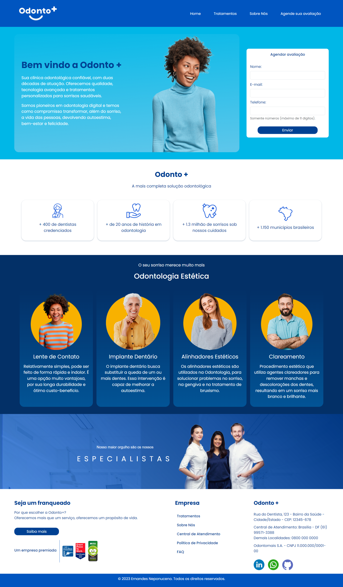

## Site clínica Odonto+ com Angular, Typescript e CSS.

Site completo com 4 páginas originais.

Os temas abordados são: 

- Responsividade e Design UI.
- Roteamento.
- Tratamento de formulários.
- Diretivas estruturais.
- Componentes. 

## Estrutura do Projeto:

- **src/**
  - **app/**
    - **contato/**
        - **diferenciais/**
        - **duvidas/**
        - **formulario/**
        - **contato.component.html/**
    - **home/**
        - **quarta-sessao/**
        - **segunda-sessao/**
        - **terceira-sessao/**
        - **home.component.html/**
    - **shared/**
        - **footer/**
        - **header/**
        - **navbar/**
        - **shared.module.ts/**
    - **sobre/**
        - **avaliacao/**
        - **resumo/**
        - **sobre.component.html/**
    - **tratamentos/**
        - **chamada/**
        - **opcoes/**
        - **tratamentos.component.html/**
  - **assets/**
    - **Arquivos de imagens**
  - **index.html:** Arquivo HTML de encabeçamento.

## 🤔 O que aprendi com esse projeto:

## Angular

Estruturação de Aplicações:
Organização de código em módulos, componentes, serviços e roteamento.
Separação clara entre lógica de apresentação (HTML/CSS) e lógica de negócio (TypeScript).

Componentes:
Criação e reutilização de componentes.
Passagem de dados entre componentes através de propriedades e eventos.

Templates:
Uso de diretivas estruturais (*ngFor, *ngIf).
Bindings de propriedades e eventos ([src], (click)).

Serviços e Injeção de Dependência:
Criação de serviços para lógica de negócios e injeção em componentes.

Formulários:
Criação de formulários reativos e template-driven.
Validação de formulários e tratamento de erros.

Roteamento:
Configuração de rotas e navegação entre páginas.
Roteamento dinâmico e passagem de parâmetros nas rotas.

## TypeScript

Tipagem Estática:
Uso de tipos para variáveis, parâmetros e retornos de funções.
Definição de interfaces e classes para modelar dados.

Classes e Objetos:
Criação de classes e instância de objetos.
Uso de modificadores de acesso (public, private, protected).

Funções e Métodos:
Declaração de funções com tipos específicos.
Implementação de métodos em classes.

Arrow Functions:
Utilização de arrow functions para preservar o contexto this.

Módulos e Importações:
Importação e exportação de módulos.
Organização do código em diferentes arquivos.

## 💻 Tecnologias utilizadas nesse projeto:

  
  
  
  

## 💻 Preview:

- Veja como ficou o projeto acessando: [Link](https://angular-typescript-css-site-clinica.vercel.app/home)

## Autor
- Ernandes Neponuceno - [Linkedin](https://www.linkedin.com/in/ernandes-neponuceno/)

